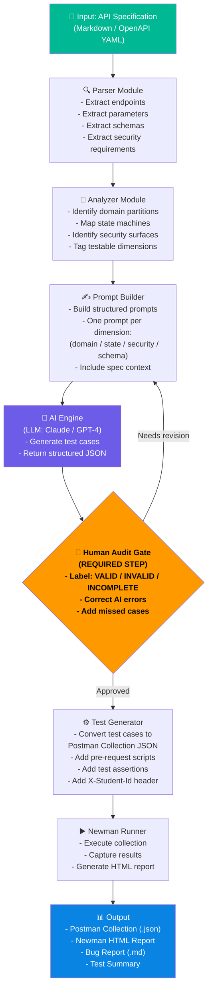

# Agent Skill — AI-Driven API Test Generator Design
## Student ID: 23127147
## HW06 — G9.5 Create Level

---

## 1. Overview

Thiết kế một hệ thống **AI-driven API Test Generator** có khả năng tự động sinh test cases từ API specification, thực thi chúng qua Postman/Newman, và xuất báo cáo — với sự giám sát của con người tại các điểm kiểm tra quan trọng.

---

## 2. System Architecture Diagram (Mermaid — Self-designed)



> **Note:** The "Human Audit Gate" (orange) is my own design decision — AI-generated test cases must always be reviewed before execution. This is not in the AI's output; it's the key architectural principle I added.

---

## 3. Component Descriptions

### 3.1 Parser Module
**Input:** API specification (Markdown or OpenAPI YAML)
**Output:** Structured endpoint descriptor objects

```python
class EndpointDescriptor:
    method: str           # GET, POST, PUT, DELETE
    path: str             # /api/login
    parameters: list      # [{name, type, required, constraints}]
    request_body: dict    # {fields, types, validations}
    response_schema: dict # {200: {...}, 401: {...}}
    security: list        # [SEC-01, SEC-02, ...]
    feature_id: str       # FR-02
```

### 3.2 Analyzer Module
**Input:** List of EndpointDescriptors
**Output:** TestDimensions per endpoint

```python
class TestDimensions:
    domain_partitions: list   # [{param, valid_cases, invalid_cases}]
    state_transitions: list   # [{from_state, to_state, valid}]
    security_surfaces: list   # [SQL_INJECTION, XSS, IDOR, ...]
    schema_fields: list       # [{field, type, required}]
```

### 3.3 Prompt Builder
**Strategy:** One focused prompt per test dimension (NOT one mega-prompt)

```python
def build_prompt(endpoint, dimension):
    return f"""
    API: {endpoint.method} {endpoint.path}
    Spec: {endpoint.request_body}
    
    Task: Generate test cases for {dimension.type}:
    {dimension.context}
    
    Format: Return JSON array of test cases:
    [{{"id": "TC-001", "name": "...", "input": {{}}, "expected_status": 200, "expected_body": {{}}}}]
    
    Target: {dimension.min_cases} test cases minimum.
    """
```

### 3.4 AI Engine
- Calls LLM API (Claude / GPT-4) with structured prompts
- Receives JSON array of test cases
- Validates JSON schema of output

### 3.5 Human Audit Gate *(Key Design Decision)*
- Displays generated test cases in a UI/CLI
- Tester marks each case: `VALID` / `INVALID` / `INCOMPLETE`
- Tester can edit or add new cases
- Only approved cases proceed to the next stage

### 3.6 Test Generator
**Input:** Audited test cases (JSON)
**Output:** Postman Collection JSON

```python
def generate_postman_request(test_case, env):
    return {
        "name": f"{test_case.id} {test_case.name}",
        "event": [{
            "listen": "prerequest",
            "script": {"exec": [
                "pm.request.headers.add({key:'X-Student-Id', value:'23127147'});"
            ]}
        }, {
            "listen": "test",
            "script": {"exec": build_test_assertions(test_case)}
        }],
        "request": {
            "method": test_case.method,
            "url": f"{{{{base_url}}}}{test_case.path}",
            "body": {"raw": json.dumps(test_case.input)}
        }
    }
```

### 3.7 Newman Runner
```bash
newman run collection.json \
  --environment environment.json \
  --reporters html,cli \
  --reporter-html-export output/report.html \
  --delay-request 300
```

---

## 4. Pseudocode — Main Pipeline

```python
def generate_api_tests(api_spec_path: str, student_id: str) -> TestOutput:
    """
    Main pipeline: spec → test cases → Postman collection → Newman report
    """
    
    # Step 1: Parse
    spec = parse_api_specification(api_spec_path)
    endpoints = spec.extract_endpoints()
    
    # Step 2: Analyze
    test_plans = []
    for endpoint in endpoints:
        dimensions = analyze_dimensions(endpoint)
        test_plans.append((endpoint, dimensions))
    
    # Step 3: Generate with AI (per dimension)
    raw_test_cases = []
    for endpoint, dimensions in test_plans:
        for dimension in dimensions:
            prompt = build_prompt(endpoint, dimension)
            ai_response = call_llm(prompt)
            parsed_cases = parse_json_response(ai_response)
            raw_test_cases.extend(parsed_cases)
    
    # Step 4: HUMAN AUDIT GATE (mandatory)
    audited_cases = human_review(raw_test_cases)
    # Returns only VALID and corrected cases
    
    # Step 5: Generate Postman Collection
    collection = PostmanCollection(name=f"AI-Generated Tests - {student_id}")
    collection.add_prerequest_script(f"pm.request.headers.add({{key:'X-Student-Id',value:'{student_id}'}});")
    
    for test_case in audited_cases:
        request = generate_postman_request(test_case)
        collection.add_request(request)
    
    collection.save("output/collection.json")
    
    # Step 6: Execute
    result = newman_run(
        collection="output/collection.json",
        report="output/report.html"
    )
    
    # Step 7: Output
    return TestOutput(
        collection=collection,
        newman_report=result.html_report,
        bug_report=extract_bugs(result),
        summary=TestSummary(
            total=len(audited_cases),
            passed=result.passed,
            failed=result.failed,
            bugs_found=len(extract_bugs(result))
        )
    )


def analyze_dimensions(endpoint) -> list[TestDimension]:
    """Identify all testable dimensions for an endpoint"""
    dimensions = []
    
    # Domain partitions
    for param in endpoint.parameters:
        dimensions.append(DomainPartitionDimension(param))
    
    # State transitions (if endpoint has state machine)
    if endpoint.has_state_machine():
        dimensions.append(StateTransitionDimension(endpoint.state_machine))
    
    # Security
    for sec_req in endpoint.security_requirements:
        dimensions.append(SecurityDimension(sec_req))
    
    # Schema validation
    dimensions.append(SchemaValidationDimension(endpoint.response_schema))
    
    return dimensions


def human_review(test_cases: list) -> list:
    """
    Interactive human review step
    Returns only approved and corrected test cases
    """
    approved = []
    for case in test_cases:
        label = prompt_user(f"Review {case.id}: {case.name}\n[V]alid / [I]nvalid / [N]eeds correction")
        if label == 'V':
            approved.append(case)
        elif label == 'N':
            corrected = prompt_user_correction(case)
            approved.append(corrected)
        # 'I' = skip/discard
    return approved
```

---

## 5. Demonstration Plan

The Agent Skill would be demonstrated as follows:
1. Provide `api_specification.md` as input
2. System parses and identifies 15+ endpoints
3. Generates prompts for each dimension automatically
4. AI generates 120+ raw test cases
5. Human audit gate reviews and approves ~100 cases
6. System generates Postman collection with all 100 cases
7. Newman runs and produces HTML report
8. Bug report extracted from failed assertions

**YouTube Demo:** *(To be recorded — would show the full pipeline running for POST /api/login)*
